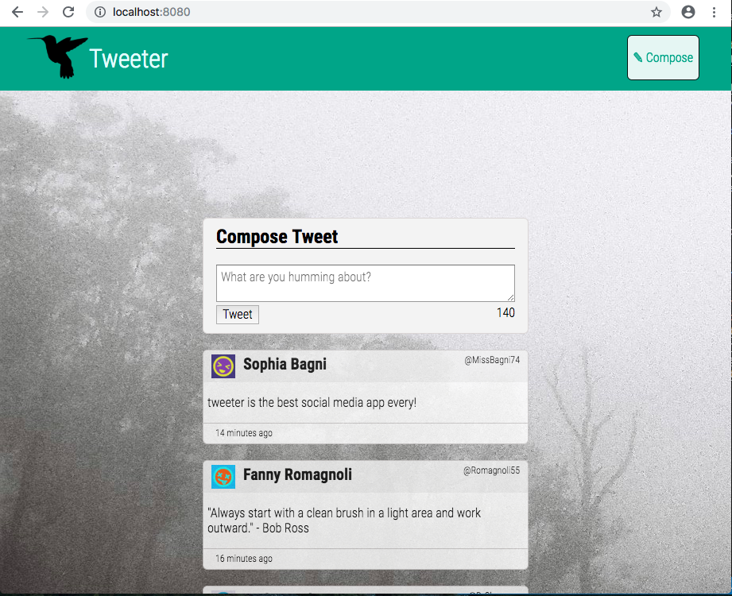

# Tweeter Project

Tweeter is a simple, single-page Twitter clone.

This repository is the code for my project: i used a clone of the lighthouse labs tweeter project to start, which contained partial code that i added to.

## purpose

the purpose of this project was to fork and clone lighthouselabs starter repository, then build upon it to practice HTML, CSS, JS, jQuery and AJAX front-end skills, and Node, Express and MongoDB back-end skills.

## Getting Started

1. Install dependencies using the `npm install` command.
2. Start the web server using the `npm run local` command. The app will be served at <http://localhost:8080/>.
3. Go to <http://localhost:8080/> in your browser.

## Dependencies

- Express
- Node 5.10.x or above
- body-parser
- chance
- md5
- mongodb
- sass

## screenshots

